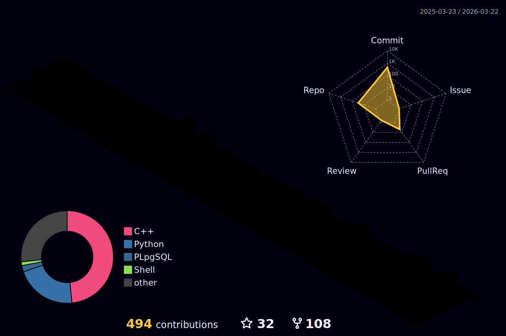

### ⚡ Social

<p align="center">
  <i>Welcome!</i>

<p align="center">
  <a href= "https://github.com/zeidk/">
    
  </a>
  <a href= "https://www.linkedin.com/in/zeidkootbally/">
    
  </a>

  <a href= "[https://www.nist.gov/people/zeid-kootbally](https://www.nist.gov/people/zeid-kootbally)">
    
  </a>
</p>


### ⚡ Toolbelt

<p float="left">
  
  
  
  
  
  
  
  
  
  
  
  

  
  
</p>

### ⚡ Stats

<!-- [](https://github.com/anuraghazra/github-readme-stats) -->

<p align="center">
<a href="https://github.com/anuraghazra/github-readme-stats">
  
</a>
<a href="https://github.com/anuraghazra/convoychat">
  
</a>
</p>


<p align="center">
  <a href= "./profile-3d-contrib/profile-night-rainbow.svg">
    
  </a>
</p>

---

<!-- <a href= "">
    
  </a> -->
  


<!--START_SECTION:waka-->

[](https://wakatime.com/badge/user/af609a7f-e79c-4b20-b63d-6f86656210f4/project/3c423add-d75b-4fd4-9bca-b452ef484eeb)

### ⚡ Code

```text
C++         5 hrs 23 mins   █████████████▒░░░░░░░░░░░   52.78 %
Python     1 hr 17 mins    ███▒░░░░░░░░░░░░░░░░░░░░░   12.70 %
```

<!--END_SECTION:waka-->

