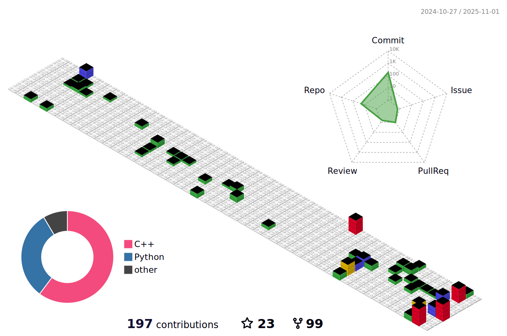

[](https://github.com/zeidk/zeidk/actions/workflows/profile-3d.yml)
[](https://github.com/zeidk/zeidk/actions/workflows/metrics.yml)
[](https://github.com/zeidk/zeidk/actions/workflows/analysis.yml)
[](https://github.com/zeidk/zeidk/actions/workflows/wakatime.yml)


<h1 align="center">Zeid Kootbally</h1>


<h5 align="center">Computer Scientist at the National Institute of Standards and Technology (NIST)</h5>

<p align="center">
	
</p>


<p align="center">

</p>


### ⚡ Social

<p align="center">
  <a href= "https://github.com/zeidk/">
    
  </a>
  <a href= "https://www.linkedin.com/in/zeidkootbally/">
    
  </a>

  <a href= "https://www.nist.gov/people/zeid-kootbally">
    
  </a>
	
<a href= "https://scholar.google.com/citations?user=zntPecQAAAAJ&hl=en">
    
  </a>

  <a href= "https://github.com/zeidk/resume/blob/main/resume.pdf">
    
  </a>
	

</p>

### ⚡ Tech

<p align="center">
  <a href= "https://isocpp.org/">
    
  </a>
  
  <a href= "https://www.python.org/">
    
  </a>

  <a href= "https://www.latex-project.org/">
    
  </a>
<!--    -->
<!--    -->
<a href= "https://www.docker.com/">
  
  </a>
<!--    -->
<a href= "https://www.ros.org/">
  
  </a>
<!--    -->
<a href= "https://code.visualstudio.com/">
  
  </a>
  <a href= "https://ubuntu.com/">
  
  </a>
</p>


### ⚡ Past Week

<!-- <p align="center">

</p> -->

<!--START_SECTION:waka-->

```txt
Total Time: 10 hrs 5 mins

C++          7 hrs 54 mins   ██████████████████▓░░░░░░   74.76 %
CMake        41 mins         █▓░░░░░░░░░░░░░░░░░░░░░░░   06.60 %
XML          31 mins         █▒░░░░░░░░░░░░░░░░░░░░░░░   05.04 %
Other        28 mins         █░░░░░░░░░░░░░░░░░░░░░░░░   04.57 %
Bash         17 mins         ▓░░░░░░░░░░░░░░░░░░░░░░░░   02.73 %
```

<!--END_SECTION:waka-->

---

<p align="center">

</p>

<!-- ### ⚡ All Time Stats

<p align="center">

</p> -->


<!-- <p align="center">
	<a href= "./profile-3d-contrib/profile-south-season-animate.svg">

		</a>
<a href= "./profile-3d-contrib/profile-south-season-animate.svg">
    
  </a>
	</p> -->
<!--  -->


<!-- <p align="center">
<a href="https://github.com/anuraghazra/github-readme-stats">
  
</a>
<a href="https://github.com/anuraghazra/convoychat">
  
</a>
</p> -->


